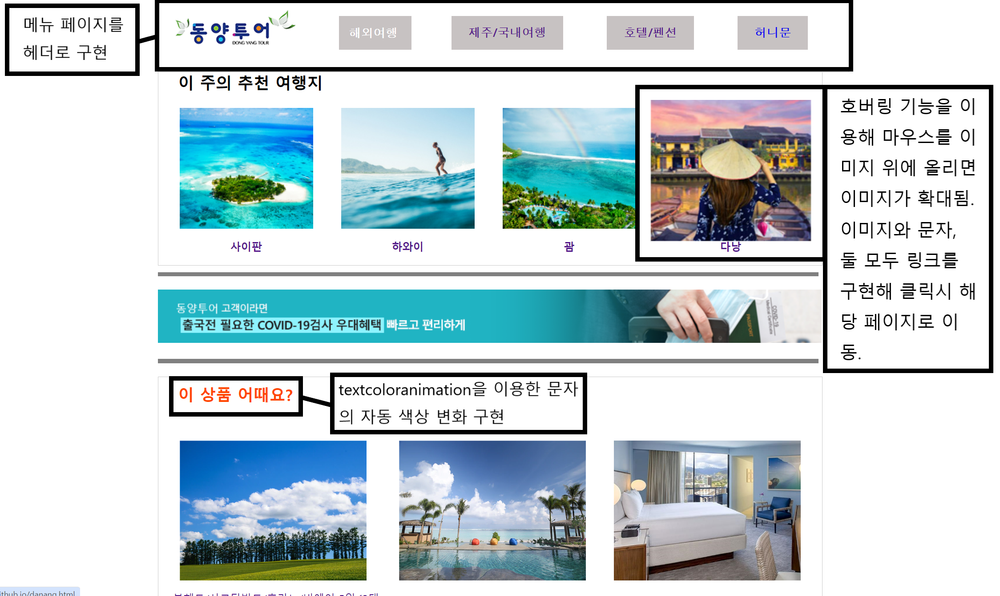

## 프로젝트 개요
2022년에 html/css을 이용하여 [여행 사이트 홈페이지](https://smokypine.github.io/)를 제작했습니다.


## Stack
```
html/css
```

## About task
- html을 이용하여 홈페이지를 구현
- css를 이용해 홈페이지 디자인 구성

## 조직도
<br/><br/>

## 1. 사이트 기능
### 1-1 메인 페이지
<br/><br/>
- header를 이용해 body와 메뉴를 분리 하였으며 호버링 기능을 통해 하위 메뉴 구현.
- iframe을 이용해 여행 광고 페이지 작성. 광고 내부의 원형 버튼을 이용해 광고 전환 가능.
- Anchor를 통한 페이지 업다운 기능 구현.
- 로그인 | 회원가입 | 예약확인/결제 | 고객센터 기능은 미구현.<br/><br/><br/>

<br/><br/>
- hovering 기능을 이용해 호버링된 이미지의 확대/축소 기능 구현.
- textcoloranimation을 이용한 문자의 자동 색상 변화 구현.<br/><br/><br/>

<br/><br/>
- 페이지 상단 iframe 우측의 앵커 리스트와 연동된 업다운 기능 구현.
- [상담 문의 이미지](./메인/상담.jpg)에 좌표를 지정하여 상세보기 위치를 클릭하면 ARS 상담 페이지가 출력되는 기능 구현.
- footer 로 분리하여 body 하단에 일정한 내용을 출력하였으나 프로젝트 작성시 header와 footer를 다른 파일로 분리하고 일괄적으로 필요한 파일마다 import를 하는 개념을 몰라 각 파일마다 각각 footer를 구현.<br/><br/><br/>

### 1-2 여행지 페이지
<br/><br/>
- iframe을 이용해 [여행지 위치](https://www.google.com/maps/place/%EB%B2%A0%ED%8A%B8%EB%82%A8+%EB%8B%A4%EB%82%AD+%ED%95%98%EC%9D%B4%EC%A9%8C%EC%9A%B0+%EA%B5%B0/@16.0247149,108.1181114,11z/data=!4m6!3m5!1s0x314219b5c59ecec1:0xfd2900156004319!8m2!3d16.0472002!4d108.2199588!16s%2Fm%2F03mbk01?hl=ko&entry=ttu)가 담긴 구글맵 삽입.<br/><br/><br/>

<br/><br/>
- table 기능을 이용해 여행지 예약 페이지 작성.
- 추후 데이터베이스와의 연결을 통한 예약 기능을 구현하는 것을 목표로 함.<br/><br/><br/>

## 2. 추가적 구현 목표
1) 로그인/회원가입/마이페이지 기능.
2) Database와의 연동을 통한 여행지/회원 관리 기능.
3) header/footer 파일을 분리하여 import 하는 것으로 코드 최적화<br/><br/><br/>

## 3. 참조 사이트
- [모두투어](https://www.modetour.com/)
- [하나투어](https://www.hanatour.com/)
- [참좋은여행](https://www.verygoodtour.com/Home/PackageMain)
